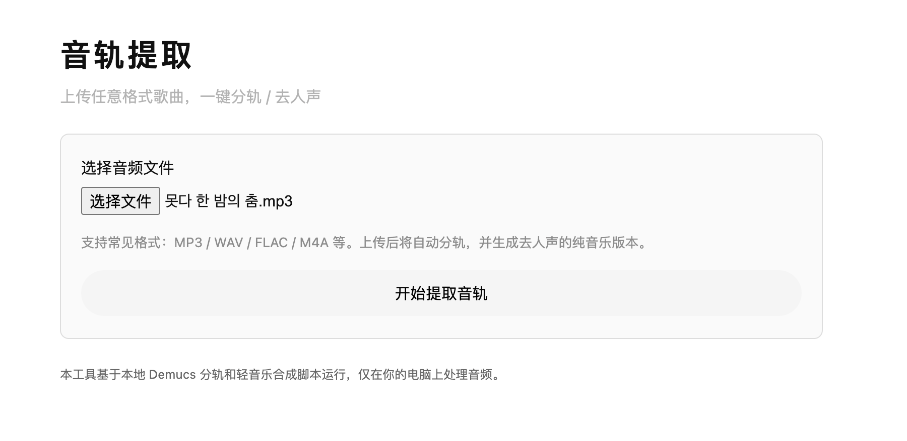
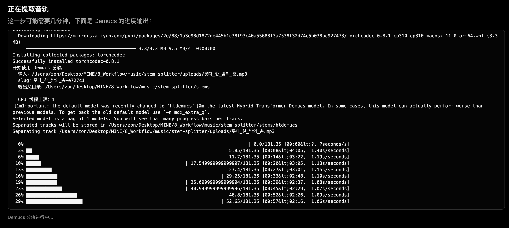
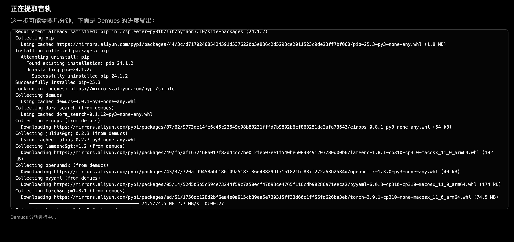
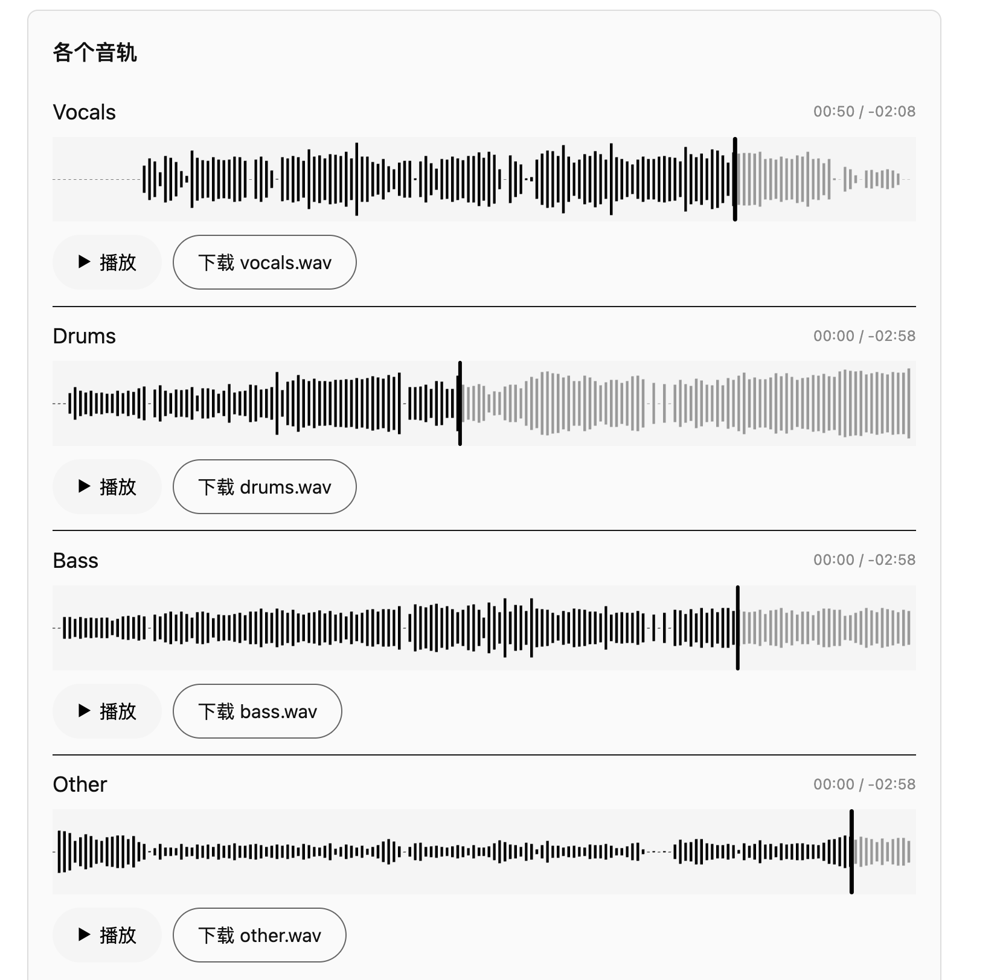

# Stem Splitter Web

简洁黑白风格的本地音轨提取网页：调用 Demucs 将歌曲分轨，并生成去人声的纯音乐版，内置波形和播放进度展示，适合作为个人工作流工具或 Demo。

## License: MIT

## 界面预览

上传界面：



提取分轨进度（耗时展示）：



首次安装依赖（Demucs / PyTorch 等）：



分轨结果页（可试听与下载）：



---

## 快速开始（本地）

在已安装 Python 3.10 和 ffmpeg 的 macOS / Linux 上：

```bash
git clone <你的仓库地址> stem-splitter
cd stem-splitter
bash scripts/run_local.sh
```

首次运行会自动创建虚拟环境并安装 Demucs 等依赖，时间可能稍长。之后上传一首歌即可看到分轨进度与结果页面（包含各轨道波形 + 播放控件）。

---

## 更多信息

- 详细功能说明、部署建议、Demo 用法和安全提示，请查看：`docs/guide.md`

注意：

- 本地 macOS / Linux 桌面机器通常也可以顺利运行，只要有可用的 Python 3.10 和 ffmpeg。
- 若并发用户较多或歌曲较长，建议提升内存与 CPU。
